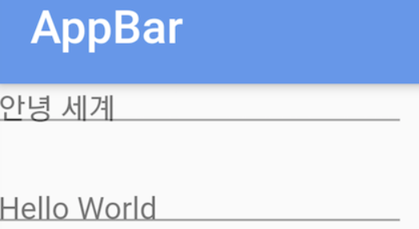

# TextField's hint look wrong with flutter_localizations

TextField 위젯의 hint 텍스트가 약간 아래로 쳐지는 현상이 있는데.. 알고보니 flutter_localizations 패키지와 관련이 있는 듯 하다.
그것도 Korean같은 언어를 쓸때만 재현되는거 같다 (다른 언어로는 안해봄).



이렇게보면 잘 모를수도 있는데 hint 텍스트가 underline과 겹친다. 원래는 겹치면 안된다.
여기서 supportedLocales에서 Korean을 빼면 제대로 나오게 된다.

관련해서 [이슈 제보](https://github.com/flutter/flutter/issues/42393)를 했다!

근데 이슈 제보하고나서 찾아보니 이미 동일한 이슈로 올린게 있더라고.. (미리 찾아보는걸 깜빡.. 바로 닫음)

결론은 아래와 같이 설정하면 해결이 된다:

```dart
ThemeData(
    textTheme: TextTheme(subhead: TextStyle(textBaseline: TextBaseline.alphabetic)),
```
