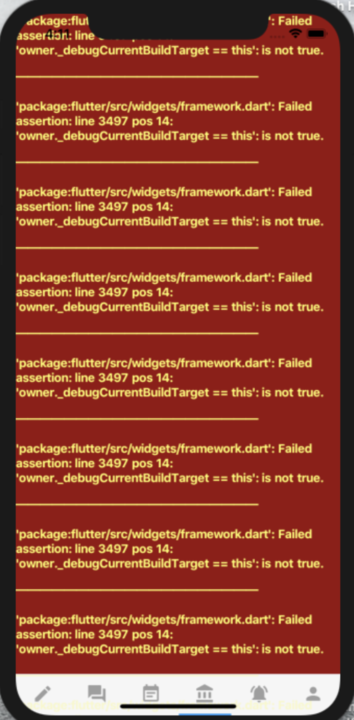

# Custom Error View

Flutter에서 에러가 발생하면 아래와 같은 빨간 에러 화면이 나온다:



요게 개발 중일때는 유용한 화면이지만 프로덕션에서는 에러가 발생하더라도 좀 더 나이스한 방식으로 풀어야하지 않겠나.

그래서 에러뷰를 커스터마이징 할 수 있는 방법이 있다:

```dart
@override
Widget build(BuildContext context) {
    return MaterialApp(
        ... 생략
        builder: (BuildContext context, Widget widget) {
            ErrorWidget.builder = (FlutterErrorDetails errorDetails) {
                return Center(child: Text('Custom Error View!'));
            };
            return widget;
        },
    );
}
```

`ErrorWidget.builder` 를 바꿔치기하는것이 핵심!

근데, 이왕이면 release 빌드에서만 커스텀 에러 뷰로 하는게 나을수도 있지. 개발할때는 저 빨간 화면이 편리한 기능 중 하나니까.
그럴땐 `foundation.dart` 패키지의 `kReleaseMode` 상수값을 이용해서 현재 빌드가 릴리즈 빌드인지를 확인할 수 있다.

즉, 아래와 같이 바꿀 수 있겠지:
```dart
import 'package:flutter/foundation.dart' as Foundation;

        ... 생략
        builder: (BuildContext context, Widget widget) {
            if (Foundation.kReleaseMode) {
                ErrorWidget.builder = (FlutterErrorDetails errorDetails) {
                    return Center(child: Text('Custom Error View!'));
                };
            }
            return widget;
        },
```

위와 같이 하면 릴리즈 빌드인 경우에만 커스텀 에러 뷰를 내뱉을 것이다. 좋넹
