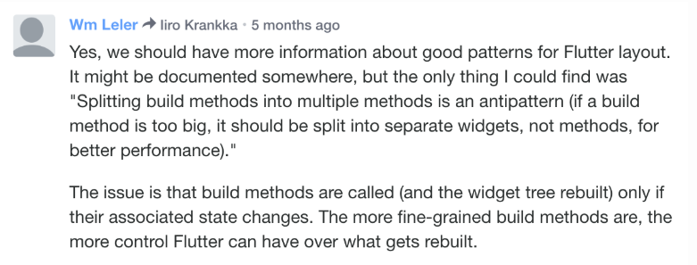

# Flutter performance best practicees

송이님이 `build()` 함수 안에서 여러 함수로 쪼개면서 하는게 퍼포먼스에 악영향을 준다고 하셨다.
대신 여러 `StatelessWidget`으로 쪼개는건 괜찮다고... 겉보기엔 동일해보이는데 왜 이런 차이가 나는지해서 찾아봤다.
우선은 [요 사이트](https://flutter.dev/docs/testing/best-practices)를.

위 글에서 가장 크게 느낀 점들 몇가지를 적어보면:

1. Avoid overly large single Widgets with a large build() function.
    - The traversal to rebuild all descendents stops when the same instance of the child widget as the previous frame is re-encountered. This technique is heavily used in inside the framework for optimizing animations where the animation doesn’t affect the child subtree.
    
2. Apply effects only when needed
    - Use effects carefully, as they can be expensive. Some of them invoke saveLayer() behind the scenes, which can be an expensive operation.
    - 이건 나도 다음앱 QA때 느꼈지... `saveLayer()`의 퍼포먼스란 후..
    - 특히 `Opacity`라는 위젯은 거의 쓰지 말라고하네. 결론적으론 잘못 만든 위젯인가 ㅋ.ㅋ

3. Render grids and lists lazily
    - Use the lazy methods, with callbacks, when building large grids or lists. That way only the visible portion of the screen is built at startup time.
    - 이건 어찌보면 당연한. `ListView.builder`같은 애를 써야지. 몇개 안되면 상관없지만.
    
4. Build and display frames in 16ms
    - Since there are two separate threads for building and rendering, you have 16ms for building, and 16ms for rendering on a 60Hz display. If latency is a concern, build and display a frame in 16ms or less.
    - 흠 [profile mode](https://flutter.dev/docs/testing/build-modes#profile)를 통해서 build와 render의 속도를 잴 수 있구만.
    
좋당. 둘째는 요거: 

아.. 고로쿠나. 근데 저거 트위터 맞지? 역시 트위터는 소식통인가봐.. 트위터를 자주 봐야하는데.

암튼 그렇다고 하신다. 저거 보면서 [이 글](https://iirokrankka.com/2018/12/11/splitting-widgets-to-methods-performance-antipattern/)도 읽어보았다:

1. method로 쪼개버리면 특정 method와 완전 상관없는 state 값이 변해도 무조건 rebuild가 되어버린다. rebuild할 이유가 없는데! 일리가있어.
한편 method가 아닌 관련 있는 state 값을 파라미터로 받는 StatelessWidget으로 분리했다면 해당 state가 변할 때만 rebuild 되겠지 (이론상으로. 실제로 해보진않음 아직).
    - [요런 답변](https://stackoverflow.com/a/53234826)에서도 비슷한 말을 하네.
    
2. 아 글구 StatelessWidget으로 쪼갤거면 const로 선언하는게 좋음. 예컨대 `child: _CustomWidget()` 보다는 `child: const _CustomWidget()`.

3. 위 글 사람은 자기가 작성한 [이 예제](https://github.com/roughike/inKino/blob/development/mobile/lib/ui/event_details/event_backdrop_photo.dart)가 꽤 괜찮은거 같다며 추천한다. 좋넹.
암튼 그럼 StatelessWidget 생성할 때 받는 파라미터가 변할때만 다시 rebuild 되는거라면 관련 있는 파라미터에 의존하는 애들끼리 묶으면 될듯.

[요런 사이트](https://api.flutter.dev/flutter/widgets/StatefulWidget-class.html#performance-considerations)도 있는데 귀찮아서 안읽어봤고.. 아직은 별로 읽을 필요 없는듯.

일단은 내꺼부터 리팩토링을 해야겠는디. 아 리팩토링만 몇번째야

---

아.. 함수로 쪼개던 코드 Widget으로 쪼개는 리팩토링 하고 있었는데,
이렇게 하다보니 완전 레이아웃을 만들던 방식부터 바꿔야하네.

함수 쪼개기 방식으로 작업하던 [todo 앱](https://github.com/giantsol/todo-app)을 리팩토링 하다 보니..
음 뭐라해야하지. 더 flat한 레이아웃 형태로 바꿔야한다는 느낌이 든다.

그때는 함수 단위로 어짜피 쪼개면 되다보니 UI 덩어리들로 막 나눴는데...
이러기가 힘들구만.

고민이네.
리팩토링하려면 또 엄청 시간 걸릴텐데 ㅋㅋㅋㅋㅋ
함수 쪼개기가 비효율적인걸 알게 되었는데 일단 그냥 이렇게 쭉 작업하기에는 또 찝찝하고..
