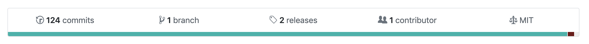
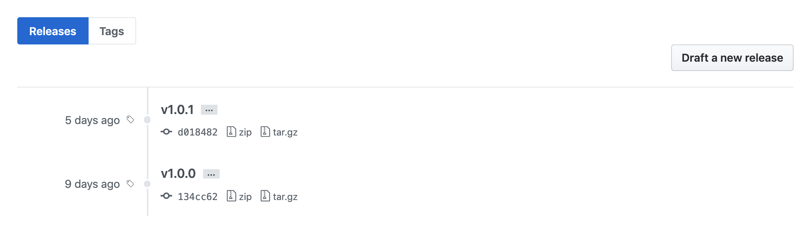

# Releases in Github

깃헙에 releases가 있다.





저걸 어떻게 하나 했더니 태그를 다는거더라.
태그는 요렇게 만들 수 있다:

```
$ git tag v1.0
```

이전 커밋에 달려면 뒤에 커밋 해시코드만 적어주면 된다:

```
$ git tag v1.0 9fc302
```

`git tag`까지만 입력하면 존재하는 태그들을 볼 수 있다.

이 태그들은 `git push origin`을 한다고 해서 서버로 올라가지 않는다. 명시적으로 적어줘야 한다:

```
$ git push origin v1.0 // v1.0 태그만 푸시
$ git push origin --tags // 모든 태그들 푸시
```

푸시까지 마치면 releases에 추가된걸 볼 수 있다.
